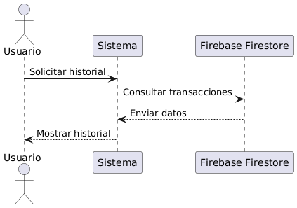

![ref1]

**UNIVERSIDAD PRIVADA DE TACNA** 

**FACULTAD DE INGENIERÍA** 

**Escuela Profesional de Ingeniería de Sistemas** 

` `**“App de Gestión Financiera para el Registro y Análisis de Gastos Personales”** 

Curso: Patrones de Software  Docente: Ing. Patrick Cuadros 

Integrantes: 

***Ayma Choque, Erick Yoel (2021072616) 
Poma Machicado, Fabiola Estefani (2021070030) Tapia Vargas, Dylan Yariet (2021072630)*** 

**Tacna – Perú *2025*** 

 ![ref2]
|CONTROL DE VERSIONES ||||||
| - | :- | :- | :- | :- | :- |
|Versión |Hecha por |Revisada por |Aprobada por |Fecha |Motivo |
|1\.0 |MPV |ELV |ARV |10/10/2020 |Versión Original |
# **App de Gestión Financiera para el Registro y Análisis de Gastos Personales** 
# **Documento de Especificación de Requerimientos de Software** 
# **Versión *{1.0}*** 

|CONTROL DE VERSIONES ||||||
| - | :- | :- | :- | :- | :- |
|Versión |Hecha por |Revisada por |Aprobada por |Fecha |Motivo |
|1\.0 |MPV |ELV |ARV |10/10/2020 |Versión Original |

**ÍNDICE GENERAL** 

[**INTRODUCCIÓN..........................................................................................................4](#_page3_x85.05_y102.61)** 

1. [**Generalidades de la Empresa..................................................................................4](#_page3_x85.05_y126.42)** 
1. [Nombre de la Empresa........................................................................................ 4](#_page3_x85.05_y142.23) 
1. [Visión...................................................................................................................4](#_page3_x85.05_y189.85) 
1. [Misión..................................................................................................................4](#_page3_x85.05_y300.69) 
1. [Organigrama........................................................................................................ 4](#_page3_x85.05_y395.73) 
2. [**Visionamiento de la Empresa................................................................................. 4](#_page3_x85.05_y443.35)** 
1. [Descripción del Problema....................................................................................4](#_page3_x85.05_y467.16) 
1. [Objetivos de Negocios......................................................................................... 4](#_page3_x85.05_y609.62) 
1. [Objetivos de Diseño.............................................................................................4](#_page4_x85.05_y84.96) 
1. [Alcance del Proyecto............................................................................................4](#_page4_x85.05_y290.66) 
1. [Viabilidad del Sistema..........................................................................................4](#_page4_x85.05_y449.13) 
1. [Información obtenida del Levantamiento de Información.................................. 4](#_page4_x85.05_y678.82) 
3. [**Análisis de Procesos............................................................................................... 4](#_page5_x85.05_y84.96)** 
1. [Diagrama del Proceso Actual – Diagrama de Actividades....................................4](#_page5_x85.05_y100.77) 
1. [Diagrama del Proceso Propuesto – Diagrama de Actividades Inicial...................4](#_page5_x85.05_y267.80) 
4. [**Especificación de Requerimientos de Software.......................................................4](#_page5_x85.05_y339.22)** 
1. [Cuadro de Requerimientos Funcionales Inicial....................................................4](#_page5_x85.05_y355.03) 
1. [Cuadro de Requerimientos No Funcionales.........................................................4](#_page6_x85.05_y338.16) 
1. [Cuadro de Requerimientos Funcionales Final......................................................4](#_page7_x85.05_y278.51) 
1. [Reglas de Negocio................................................................................................4](#_page9_x85.05_y194.01) 
5. [**Fase de Desarrollo..................................................................................................4](#_page11_x85.05_y84.96)** 
1. [Perfiles de Usuario...............................................................................................4](#_page11_x85.05_y100.77) 
1. [Modelo Conceptual............................................................................................. 4](#_page11_x85.05_y290.66) 
1. [Diagrama de Paquetes................................................................................4](#_page11_x85.05_y314.47) 
1. [Diagrama de Casos de Uso..........................................................................4](#_page12_x85.05_y84.96) 
1. [Escenarios de Caso de Uso (Narrativa)....................................................... 4](#_page13_x85.05_y84.96) 
3. [Modelo Lógico..................................................................................................... 4](#_page18_x85.05_y101.81) 
1. [Análisis de Objetos......................................................................................4](#_page18_x85.05_y125.62) 
1. [Diagrama de Actividades con Objetos........................................................ 4](#_page26_x85.05_y84.96) 
1. [Diagrama de Secuencia...............................................................................4](#_page33_x85.05_y84.96) 
1. [Diagrama de Clases.....................................................................................4](#_page39_x85.05_y84.96) 

[**CONCLUSIONES..........................................................................................................4](#_page39_x85.05_y345.80) **[RECOMENDACIONES.................................................................................................. 4](#_page39_x85.05_y369.61)** 
# [**BIBLIOGRAFÍA............................................................................................................4](#_page39_x85.05_y393.41) ****INTRODUCCIÓN 
1. Generalidades de la Empresa 
1. Nombre de la Empresa 

   BCP - Banco de Crédito Personalizado  

2. Visión 

   Ser el banco líder en todos los segmentos y productos que ofrecemos, promoviendo el éxito de nuestros clientes con soluciones financieras adecuadas para sus necesidades, facilitando el desarrollo de nuestros colaboradores, generando valor para nuestros accionistas y apoyando el desarrollo sostenido del país. 

3. Misión 

   Promover el éxito de nuestros clientes con soluciones financieras adecuadas para sus necesidades, facilitar el desarrollo de nuestros colaboradores, generar valor para nuestros accionistas y apoyar el desarrollo sostenido del país. 

4. Organigrama 
2. Visionamiento de la Empresa 
1. Descripción del Problema 

   En el contexto actual, muchos clientes enfrentan desafíos relacionados con la accesibilidad y la eficiencia de los servicios bancarios tradicionales. La necesidad de soluciones digitales que ofrezcan comodidad, seguridad y personalización es cada vez más evidente. Además, la creciente demanda de servicios financieros inclusivos y sostenibles requiere una respuesta ágil y adaptada a las nuevas tecnologías. 

2. Objetivos de Negocios 
- Expandir la inclusión financiera, proporcionando acceso a servicios bancarios a segmentos de la población no atendidos. 
- Incrementar la digitalización de los servicios, ofreciendo plataformas en línea que faciliten la gestión de cuentas y transacciones. 
- Mejorar la experiencia del cliente, personalizando los servicios para satisfacer sus necesidades específicas. 
- Fortalecer la sostenibilidad financiera, implementando prácticas que aseguren la estabilidad y crecimiento del banco. 
3. Objetivos de Diseño 
   1. Desarrollar interfaces de usuario intuitivas, que faciliten la navegación y uso de las plataformas digitales del banco. 
   1. Implementar sistemas de seguridad avanzados, que protejan la información y transacciones de los clientes. 
   1. Integrar tecnologías emergentes, como inteligencia artificial y análisis de datos, para ofrecer servicios personalizados y eficientes. 
   1. Garantizar la accesibilidad, asegurando que los servicios sean utilizables por personas con diversas capacidades y en diferentes contextos. 
3. Alcance del Proyecto 

   El proyecto abarca la creación y mejora de plataformas digitales que permitan a los clientes realizar operaciones bancarias de manera remota, segura y eficiente. Esto incluye el desarrollo de aplicaciones móviles y web, la implementación de sistemas de atención al cliente en línea y la integración de servicios financieros digitales que respondan a las necesidades actuales del mercado. 

5. Viabilidad del Sistema 

   **Técnica**: Se utilizarán tecnologías modernas y escalables que aseguren el rendimiento y la seguridad de las plataformas digitales. 

   **Económica**: El proyecto se financiará mediante una combinación de recursos internos y externos, con un enfoque en la rentabilidad a largo plazo. 

   **Regulatoria**: Se cumplirá con todas las normativas y regulaciones vigentes en el sector financiero, garantizando la transparencia y legalidad de las operaciones. 

6. Información obtenida del Levantamiento de Información 
3. Análisis de Procesos 
1. Diagrama del Proceso Actual – Diagrama de Actividades 

2. Diagrama del Proceso Propuesto – Diagrama de Actividades Inicial 
4. Especificación de Requerimientos de Software 
1. Cuadro de Requerimientos Funcionales Inicial 

|RF |Requerimiento |Descripción |
| - | - | - |
|RF01 |Registrar usuario |Registro de usuarios con email y contraseña. |
|RF02|Iniciar sesión  |Inicio de sesión con validación de credenciales y autenticación de usuario. |
|RF03 |Recuperar contraseña |Recuperación de contraseña mediante enlace de recuperación. |
|RF04 |Gestionar perfil |Gestión de perfil de usuario (editar, ver información). |
|RF05 |Registrar ingresos |Registro de ingresos (monto, categoría, fecha, descripción). |
|RF06 |Registrar egresos |Registro de egresos (monto, categoría, fecha, descripción, ubicación opcional). |
|RF07 |Editar transacciones  |Edición de transacciones registradas. |
|RF08 |Generar gráficos de gastos |Generación de gráficos de gastos por categoría (barras, pastel). |
|RF09 |Visualizar histórico financiero |Visualización de histórico mensual/anual de ingresos y egresos. |
|RF10 |Comparar gastos |Comparación de gastos entre diferentes periodos. |
|RF11 |Generar balance general |Generación de balance general (ingresos vs egresos). |
| - | :- | - |
|RF12 |Clasificar gastos desde imagen |El sistema escanea fotos de boletas y extrae montos, y los categoriza automáticamente. |
|RF13 |Notificar gastos excesivos |Alertar cuando los gastos superen un porcentaje de los ingresos. |
|RF14 |Alertar sobre presupuesto  |Avisar cuando se alcance el límite presupuestado en una categoría. |
|RF15 |Generar reportes en PDF |Crear informes financieros en formato PDF. |
|RF16 |Exportar datos |Permitir la exportación de datos a formatos CSV o Excel. |

2. Cuadro de Requerimientos No Funcionales 

|RNF |Requerimiento |Descripción |
| - | - | - |
|RNF01 |Rendimiento |El aplicativo debe responder rápidamente en todas las operaciones comunes (registrar transacciones, generar reportes, mostrar gráficos) sin demoras notables, con tiempos de carga no mayores a 2 segundos. |
|RNF02|Seguridad |Los datos del usuario (como contraseñas y transacciones) deben estar protegidos mediante encriptación robusta (como AES-256) y protocolos de seguridad actualizados (como HTTPS y autenticación multifactor). |
|RNF03 |Usabilidad |La interfaz del aplicativo debe ser intuitiva y fácil de usar, permitiendo a los usuarios completar tareas como ingresar transacciones y visualizar reportes sin complicaciones. La navegación debe ser fluida tanto en dispositivos móviles como en escritorio. |
|RNF04 |Escalabilidad |El aplicativo debe ser capaz de manejar un número creciente de usuarios y transacciones sin afectar su rendimiento. Se debe poder escalar en la base de datos y en el manejo de reportes sin comprometer la experiencia del usuario. |
|RNF05 |Disponibilidad |El sistema debe estar disponible la mayor parte del tiempo, con un mínimo de 99.5% de tiempo de funcionamiento sin interrupciones significativas. |
|RNF06 |Mantenimiento |El aplicativo debe permitir actualizaciones y mejoras continuas sin que los usuarios experimenten interrupciones significativas. La implementación de nuevas funcionalidades no debe requerir reescritura del código base. |
| - | - | :- |
|RNF07 |Notificaciones |El aplicativo debe permitir la configuración de notificaciones push para alertas personalizadas (gastos excesivos, presupuesto, pagos recurrentes) que se envíen en tiempo real, asegurando que el usuario esté siempre al tanto de sus finanzas. |

3. Cuadro de Requerimientos Funcionales Final 

|RF |Requerimiento |Descripción |
| - | - | - |
|RF01 |Registrar usuario|Registro de usuarios con email y contraseña. |
|RF02|Iniciar sesión  |Inicio de sesión con validación de credenciales y autenticación de usuario. |
|RF03 |Recuperar contraseña |Recuperación de contraseña mediante enlace de recuperación. |
|RF04 |Gestionar perfil |Gestión de perfil de usuario (editar, ver información). |
|RF05 |Registrar ingresos |Registro de ingresos (monto, categoría, fecha, descripción). |
|RF06 |Registrar egresos|Registro de egresos (monto, categoría, fecha, descripción, ubicación opcional). |
|RF07 |Editar transacciones|Edición de transacciones registradas. |
|RF08 |Generar gráficos de gastos |Generación de gráficos de gastos por categoría (barras, pastel). |
|RF09 |Visualizar histórico financiero |Visualización de histórico mensual/anual de ingresos y egresos. |
|RF10 |Comparar gastos|Comparación de gastos entre diferentes periodos. |
|RF11 |Generar balance |Generación de balance general (ingresos vs egresos). |
||general ||
| :- | - | :- |
|RF12 |Clasificar gastos desde imagen |El sistema escanea fotos de boletas y extrae montos, y los categoriza automáticamente. |
|RF13 |Notificar gastos excesivos |Alertar cuando los gastos superen un porcentaje de los ingresos. |
|RF14 |Alertar sobre presupuesto  |Avisar cuando se alcance el límite presupuestado en una categoría. |
|RF15 |Generar reportes en PDF |Crear informes financieros en formato PDF. |
|RF16 |Exportar datos |Permitir la exportación de datos a formatos CSV o Excel. |
|RNF01 |Rendimiento |El aplicativo debe responder rápidamente en todas las operaciones comunes (registrar transacciones, generar reportes, mostrar gráficos) sin demoras notables, con tiempos de carga no mayores a 2 segundos. |
|RNF02|Seguridad |Los datos del usuario (como contraseñas y transacciones) deben estar protegidos mediante encriptación robusta (como AES-256) y protocolos de seguridad actualizados (como HTTPS y autenticación multifactor). |
|RNF03 |Usabilidad |La interfaz del aplicativo debe ser intuitiva y fácil de usar, permitiendo a los usuarios completar tareas como ingresar transacciones y visualizar reportes sin complicaciones. La navegación debe ser fluida tanto en dispositivos móviles como en escritorio. |
|RNF04 |Escalabilidad |El aplicativo debe ser capaz de manejar un número creciente de usuarios y transacciones sin afectar su rendimiento. Se debe poder escalar en la base de datos y en el manejo de reportes sin comprometer la experiencia del usuario. |
|RNF05 |Disponibilidad |El sistema debe estar disponible la mayor parte del tiempo, con un mínimo de 99.5% de tiempo de funcionamiento sin interrupciones significativas. |
|RNF06 |Mantenimiento |El aplicativo debe permitir actualizaciones y mejoras continuas sin que los usuarios experimenten interrupciones significativas. La implementación de nuevas funcionalidades no debe requerir reescritura del código base. |
|RNF07 |Notificaciones |El aplicativo debe permitir la configuración de notificaciones push para alertas personalizadas (gastos excesivos, presupuesto, pagos recurrentes) que se envíen en tiempo real, asegurando que el usuario esté siempre al tanto de sus finanzas. |
| - | - | :- |

4. Reglas de Negocio Validación de Usuario 

   Un usuario no puede acceder al sistema sin registrarse previamente con un correo electrónico válido y una contraseña segura. 

   Categorías Personalizadas 

   El usuario puede crear y personalizar categorías para clasificar sus transacciones (ingresos y egresos), pero no podrá eliminar las categorías predeterminadas. 

   Límites de Presupuesto 

   Los usuarios podrán establecer presupuestos mensuales para cada categoría, pero el total de los presupuestos no puede exceder el 100% de los ingresos mensuales registrados. 

   Registro de Transacciones 

   Una transacción debe incluir un monto, una categoría, una fecha y una descripción. Las transacciones no pueden ser registradas con valores negativos (a menos que se trate de un "ingreso negativo" o devolución). 

   Validación de Ingresos y Egresos 

   Los ingresos y egresos no pueden ser registrados con valores nulos o sin una categoría asociada. 

   Historial de Transacciones 

   El sistema debe permitir consultar las transacciones pasadas en un rango de fechas específico (mensual, anual, etc.). 

   Comparación de Periodos 

   Los usuarios pueden comparar sus gastos en diferentes periodos (por ejemplo, este mes vs. el mes pasado), pero solo podrán hacerlo dentro del mismo año. 

   Generación de Reportes 

   Los usuarios podrán generar reportes financieros personalizados, pero solo se incluirán transacciones que hayan sido validadas y no estén marcadas como "pendientes" o "erróneas". 

   Notificación de Gastos Excesivos 

   Si un usuario excede un porcentaje configurado de su presupuesto, se enviará una notificación de alerta. El porcentaje debe estar entre el 5% y el 50% según la configuración del usuario. 

   Recomendaciones de Ahorro 

   El sistema debe sugerir opciones de ahorro personalizadas basadas en los hábitos de gastos, considerando un umbral mínimo de ahorro recomendado que no afecte negativamente los gastos esenciales del usuario. 

   Presupuesto por Categoría 

   Los presupuestos establecidos para cada categoría no pueden ser inferiores a un valor mínimo predeterminado para asegurar que las necesidades básicas (alimentación, transporte, etc.) sean cubiertas. 

   Pagos Recurrentes 

   Los usuarios podrán configurar pagos recurrentes (por ejemplo, alquiler o suscripciones), y el sistema debe notificarles con una antelación mínima de 5 días antes de la fecha de vencimiento. 

   Exportación de Datos 

   Los usuarios pueden exportar sus datos financieros en formatos como CSV o Excel, pero los reportes exportados solo incluirán transacciones aprobadas. 

5. Fase de Desarrollo 
1. Perfiles de Usuario 

   El perfil de usuario de la aplicación está compuesto principalmente por individuos interesados en gestionar sus finanzas personales de manera eficiente. Estos usuarios pueden ser jóvenes, adultos o freelancers que buscan llevar un control de sus ingresos, egresos y presupuestos mensuales. La aplicación está diseñada para ser intuitiva y fácil de usar, permitiendo a los usuarios registrar transacciones, establecer límites de presupuesto, generar reportes financieros y recibir notificaciones sobre gastos excesivos o pagos recurrentes. Además, los usuarios valoran la seguridad de sus datos, por lo que la aplicación ofrece medidas de protección robustas, como la encriptación y autenticación multifactor. 

2. Modelo Conceptual 
1. ### Diagrama de Paquetes 
2. ### Diagrama de Casos de Uso 

3. ### Escenarios de Caso de Uso (Narrativa) 

|**Caso de uso** |CU-01 |
| - | - |
|**Actores** |Cliente |
|**Propósito** |Permitir que un nuevo cliente cree una cuenta en el sistema |
|**Tipo** |Principal |
|**Descripción** |El cliente ingresa al sistema proporcionando su información básica para crear una cuenta y poder utilizar los servicios bancarios. |
|**Precondición** |
El cliente no debe tener una cuenta existente en el sistema. 

El cliente debe tener acceso a internet. 
|
|**Curso normal de eventos** ||
|**Acciones de actores** |**Acciones de página web** |
|
1\.  El cliente selecciona la opción 

"Registrar". 
|
2\.  El sistema muestra el formulario 

de registro. 
|
|
3\.  El cliente ingresa su nombre, 

correo electrónico, número de teléfono y crea una contraseña. 
|
4\.  El sistema valida que los campos 

no estén vacíos. 
|
|
5\.  El cliente acepta los términos y 

condiciones. 
|
6\.  El sistema muestra un mensaje de 

confirmación. 
|
|7\.  El cliente envía el formulario. |
8\.  El sistema valida la información y 

crea la cuenta. 
|

|**Caso de uso** |Registrar |
| - | - |
|**Actores** |Cliente |
|**Propósito** |Permitir que un cliente se registre en el sistema creando una cuenta. |
|**Tipo** |Principal |
|**Descripción** |El cliente puede crear una cuenta |
||proporcionando la información requerida para poder utilizar el sistema. |
| :- | :- |
|**Precondición** |El cliente no debe tener una cuenta existente. |
|**Curso normal de eventos** ||
|**Acciones de actores** |**Acciones de página web** |
|**1. El cliente selecciona la opción "Registrar".** |**2. El sistema muestra un formulario de registro con campos como nombre, correo electrónico, y contraseña.** |

|**Caso de uso** |Registrar |
| - | - |
|**Actores** |Cliente |
|**Propósito** |Permitir que un cliente se registre en el sistema creando una cuenta. |
|**Tipo** |Principal |
|**Descripción** |El cliente puede crear una cuenta proporcionando la información requerida para poder utilizar el sistema. |
|**Precondición** |El cliente no debe tener una cuenta existente. |
|**Curso normal de eventos** ||
|**Acciones de actores** |**Acciones de página web** |
|**1. El cliente selecciona la opción "Registrar".** |**2. El sistema muestra un formulario de registro con campos como nombre, correo electrónico, y contraseña.** |

|**Caso de uso** |Registrar |
| - | - |
|**Actores** |Cliente |
|**Propósito** |Permitir que un cliente se registre en el sistema creando una cuenta. |
|**Tipo** |Principal |
|**Descripción** |El cliente puede crear una cuenta proporcionando la información requerida para poder utilizar el sistema. |
|**Precondición** |El cliente no debe tener una cuenta existente. |
|**Curso normal de eventos** ||
| - | :- |
|**Acciones de actores** |**Acciones de página web** |
|**1. El cliente selecciona la opción "Registrar".** |**2. El sistema muestra un formulario de registro con campos como nombre, correo electrónico, y contraseña.** |

|**Caso de uso** |Registrar |
| - | - |
|**Actores** |Cliente |
|**Propósito** |Permitir que un cliente se registre en el sistema creando una cuenta. |
|**Tipo** |Principal |
|**Descripción** |El cliente puede crear una cuenta proporcionando la información requerida para poder utilizar el sistema. |
|**Precondición** |El cliente no debe tener una cuenta existente. |
|**Curso normal de eventos** ||
|**Acciones de actores** |**Acciones de página web** |
|**1. El cliente selecciona la opción "Registrar".** |**2. El sistema muestra un formulario de registro con campos como nombre, correo electrónico, y contraseña.** |

|**Caso de uso** |Registrar |
| - | - |
|**Actores** |Cliente |
|**Propósito** |Permitir que un cliente se registre en el sistema creando una cuenta. |
|**Tipo** |Principal |
|**Descripción** |El cliente puede crear una cuenta proporcionando la información requerida para poder utilizar el sistema. |
|**Precondición** |El cliente no debe tener una cuenta existente. |
|**Curso normal de eventos** ||
|**Acciones de actores** |**Acciones de página web** |
|**1. El cliente selecciona la opción** |**2. El sistema muestra un formulario de** |
|**"Registrar".** |**registro con campos como nombre, correo electrónico, y contraseña.** |
| - | :- |

|**Caso de uso** |Registrar |
| - | - |
|**Actores** |Cliente |
|**Propósito** |Permitir que un cliente se registre en el sistema creando una cuenta. |
|**Tipo** |Principal |
|**Descripción** |El cliente puede crear una cuenta proporcionando la información requerida para poder utilizar el sistema. |
|**Precondición** |El cliente no debe tener una cuenta existente. |
|**Curso normal de eventos** ||
|**Acciones de actores** |**Acciones de página web** |
|**1. El cliente selecciona la opción "Registrar".** |**2. El sistema muestra un formulario de registro con campos como nombre, correo electrónico, y contraseña.** |

|**Caso de uso** |Registrar |
| - | - |
|**Actores** |Cliente |
|**Propósito** |Permitir que un cliente se registre en el sistema creando una cuenta. |
|**Tipo** |Principal |
|**Descripción** |El cliente puede crear una cuenta proporcionando la información requerida para poder utilizar el sistema. |
|**Precondición** |El cliente no debe tener una cuenta existente. |
|**Curso normal de eventos** ||
|**Acciones de actores** |**Acciones de página web** |
|**1. El cliente selecciona la opción "Registrar".** |**2. El sistema muestra un formulario de registro con campos como nombre, correo electrónico, y contraseña.** |
|**Caso de uso** |Registrar |
|**Actores** |Cliente |
|**Propósito** |Permitir que un cliente se registre en el sistema creando una cuenta. |
|**Tipo** |Principal |
|**Descripción** |El cliente puede crear una cuenta proporcionando la información requerida para poder utilizar el sistema. |
|**Precondición** |El cliente no debe tener una cuenta existente. |
|**Curso normal de eventos** ||
|**Acciones de actores** |**Acciones de página web** |
|**1. El cliente selecciona la opción "Registrar".** |**2. El sistema muestra un formulario de registro con campos como nombre, correo electrónico, y contraseña.** |

|**Caso de uso** |Registrar |
| - | - |
|**Actores** |Cliente |
|**Propósito** |Permitir que un cliente se registre en el sistema creando una cuenta. |
|**Tipo** |Principal |
|**Descripción** |El cliente puede crear una cuenta proporcionando la información requerida para poder utilizar el sistema. |
|**Precondición** |El cliente no debe tener una cuenta existente. |
|**Curso normal de eventos** ||
|**Acciones de actores** |**Acciones de página web** |
|**1. El cliente selecciona la opción "Registrar".** |**2. El sistema muestra un formulario de registro con campos como nombre, correo electrónico, y contraseña.** |

3. Modelo Lógico 
1. ### Análisis de Objetos 
1. Registrar usuario 

   

2. Iniciar sesión  

   

3. Recuperar contraseña 

   

4. Gestionar perfil 

   

5. Registrar ingresos 

   

6. Registrar egresos 

   

7. Editar transacciones  

   

8. Generar gráficos de gastos 

   

9. Visualizar histórico financiero 

   

10. Comparar gastos 

    

11. Generar balance general 

    

12. Clasificar gastos desde imagen 

    

13. Notificar gastos excesivos 

    

14. Alertar sobre presupuesto 

    

15. Generar reportes en PDF 

    

16. Exportar datos 

    

2. Diagrama de Actividades con Objetos Diagrama de actividad General 

1. ### **Caso de uso: Registrar usuario** 
   
2. ### **Caso de uso: Iniciar sesión **
2. ### **Caso de uso: Recuperar contraseña **
4. ### **Caso de uso: Registrar ingresos **
4. ### **Caso de uso: Registrar egresos **
6. ### **Caso de uso: Registrar con cámara **
6. ### **Caso de uso: Editar transacciones** 
   
8. ### **Caso de uso: Visualizar histórico financiero **
8. ### **Caso de uso: Generar gráficos de ingresos/gastos **
10. ### **Caso de uso: Ver balance general** 

3. Diagrama de Secuencia Diagrama de Secuencia General 

1. **Diagrama de Secuencia: Registrar usuario** 

2. **Diagrama de Secuencia: Iniciar sesión** 

3. **Diagrama de Secuencia: Recuperar contraseña** 

4. **Diagrama de Secuencia: Registrar ingresos** 

5. **Diagrama de Secuencia: Registrar egresos** 

6. **Diagrama de Secuencia: Registrar con cámara** 

7. **Diagrama de Secuencia: Editar transacciones** 

8. **Diagrama de Secuencia: Visualizar histórico financiero** 

9. **Diagrama de Secuencia: Generar gráficos de ingresos/gastos** 

10. **Diagrama de Secuencia: Ver balance general** 

4. ### Diagrama de Clases 

# CONCLUSIONES RECOMENDACIONES BIBLIOGRAFÍA 
40 

[ref1]: media/Aspose.Words.a28a7735-36dc-4e21-9a26-57f76343c64c.001.png
[ref2]: media/Aspose.Words.a28a7735-36dc-4e21-9a26-57f76343c64c.003.png
