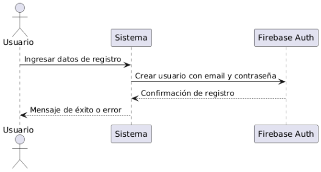
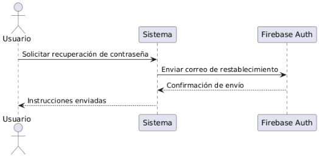
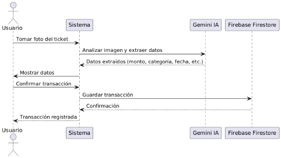

**UNIVERSIDAD PRIVADA DE TACNA** 

**FACULTAD DE INGENIERÍA** 

**Escuela Profesional de Ingeniería de Sistemas** 

***“App de Gestión Financiera para el Registro y Análisis de Gastos Personales”*** 

Curso: Patrones de Software  Docente: Ing. Patrick Cuadros 

Integrantes: 

***Ayma Choque, Erick Yoel (2021072616) 
Poma Machicado, Fabiola Estefani (2021070030) Tapia Vargas, Dylan Yariet (2021072630)*** 

**Tacna – Perú 2025** 

Logo de Mi Empresa  Logo de mi Cliente 
|CONTROL DE VERSIONES ||||||
| - | :- | :- | :- | :- | :- |
|Versión |Hecha por |Revisada por |Aprobada por |Fecha |Motivo |
|1\.0 |MPV |ELV |ARV |10/10/2020 |Versión Original |
# **App de Gestión Financiera para el Registro y Análisis de Gastos Personales** 
# **Documento de Arquitectura de Software** 
# **Versión *{1.0}*** 

|CONTROL DE VERSIONES ||||||
| - | :- | :- | :- | :- | :- |
|Versión |Hecha por |Revisada por |Aprobada por |Fecha |Motivo |
|1\.0 |MPV |ELV |ARV |10/10/2020 |Versión Original |

**Contenido** 

1. [***INTRODUCCIÓN  5***](#_page3_x85.05_y70.85)
1. [**Propósito (Diagrama 4+1)  5**](#_page3_x85.05_y115.31) 
1. [**Alcance  5**](#_page3_x85.05_y470.50) 
1. [**Definición, siglas y abreviaturas  5**](#_page4_x85.05_y306.73) 
1. **Organización del documento  5** 
2. [***OBJETIVOS Y RESTRICCIONES ARQUITECTONICAS  5***](#_page5_x85.05_y404.54)
   1. [Requerimientos Funcionales  5](#_page6_x85.05_y519.97)
   1. [Requerimientos No Funcionales – Atributos de Calidad  5](#_page6_x85.05_y590.33)
3. [***REPRESENTACIÓN DE LA ARQUITECTURA DEL SISTEMA  6***](#_page8_x85.05_y172.29)
1. **Vista de Caso de uso  6** 
   1. [Diagramas de Casos de uso  6](#_page8_x85.05_y216.86)
2. [**Vista Lógica  6**](#_page9_x85.05_y70.85) 
1. [Diagrama de Subsistemas (paquetes)  7](#_page9_x85.05_y140.28)
1. [Diagrama de Secuencia (vista de diseño)  7](#_page9_x85.05_y250.08)
1. [Diagrama de Colaboración (vista de diseño)  7](#_page14_x85.05_y630.48)
1. [Diagrama de Objetos  7](#_page14_x85.05_y668.78)
1. [Diagrama de Clases  7](#_page15_x85.05_y70.85)
1. [Diagrama de Base de datos (relacional o no relacional)  7](#_page15_x85.05_y304.72)
3. [**Vista de Implementación (vista de desarrollo)  7**](#_page15_x85.05_y593.43) 
1. [Diagrama de arquitectura software (paquetes)  7](#_page15_x85.05_y616.56)
1. [Diagrama de arquitectura del sistema (Diagrama de componentes)  7](#_page18_x85.05_y70.85)
4. [**Vista de procesos  7**](#_page18_x85.05_y423.57) 

[3.4.1. Diagrama de Procesos del sistema (diagrama de actividad)  8](#_page19_x85.05_y70.85)

5. [**Vista de Despliegue (vista física)  8**](#_page19_x85.05_y671.22) 

[3.5.1. Diagrama de despliegue  8](#_page19_x85.05_y694.34)

4. [***ATRIBUTOS DE CALIDAD DEL SOFTWARE  8*** ](#_page20_x85.05_y476.24)[Escenario de Funcionalidad  8**](#_page20_x85.05_y615.76) [**Escenario de Usabilidad  8**](#_page21_x85.05_y184.43) [**Escenario de confiabilidad  9**](#_page21_x85.05_y421.45) [**Escenario de rendimiento  9**](#_page21_x85.05_y615.48) [**Escenario de mantenibilidad  9**](#_page22_x85.05_y93.34) [**Otros Escenarios  9**](#_page22_x85.05_y287.38) 

1.  INTRODUCCIÓN 

1. Propósito (Diagrama 4+1) 

2. Alcance 

   Este proyecto tiene como objetivo desarrollar y mejorar una plataforma digital que permita a los usuarios gestionar sus finanzas personales de forma segura y eficiente. Incluye el desarrollo de aplicaciones móviles y web con las siguientes funcionalidades clave: 

1. Gestión de Finanzas Personales: 
   1. Registro y gestión de ingresos y egresos. 
   1. Creación de categorías personalizadas para transacciones. 
   1. Generación de gráficos y reportes financieros. 
1. Seguridad y Accesibilidad: 
- Protección de datos mediante encriptación y autenticación multifactor. 
- Interfaces fáciles de usar en dispositivos móviles y web. 
3. Escalabilidad y Rendimiento: 
- El sistema debe manejar un creciente número de usuarios y transacciones sin perder rendimiento. 

Límites del Alcance: 

No incluye el desarrollo de productos financieros adicionales (préstamos, inversiones, etc.). 

No se incluirán servicios físicos (atención en sucursales o cajeros automáticos). 
3. #### Definición, siglas y abreviaturas Definición de Términos Clave 
- Usuario: Persona que interactúa con la plataforma digital para gestionar sus finanzas personales. 
- Plataforma Digital: Conjunto de aplicaciones móviles y web diseñadas para la gestión de finanzas personales. 
- Transacción: Operación financiera registrada por el usuario, ya sea de ingreso o egreso. 
- Presupuesto: Límite establecido por el usuario para controlar sus gastos en diferentes categorías. 
- Reportes Financieros: Informes generados por la plataforma que muestran un resumen de las finanzas del usuario, como ingresos, egresos y balance general. 
- Notificaciones Push: Alertas enviadas a los usuarios en tiempo real sobre eventos relevantes, como gastos excesivos o pagos recurrentes. 
#### Siglas y Abreviaturas 
- RF: Requerimiento Funcional. 
- RNF: Requerimiento No Funcional. 
- MFA: Autenticación Multi Factor (Multi-Factor Authentication). 
- AES: Advanced Encryption Standard (Estándar de Encriptación Avanzado). 
- CSV: Comma Separated Values (Valores Separados por Comas). 
- PDF: Portable Document Format (Formato de Documento Portátil). 
- API: Interfaz de Programación de Aplicaciones (Application Programming Interface). 
- UX/UI: Experiencia de Usuario / Interfaz de Usuario (User Experience / User Interface). 
2. **OBJETIVOS Y RESTRICCIONES ARQUITECTÓNICAS** 

   [Establezca las prioridades de los requerimientos y las restricciones del proyecto) 

1. Priorización de requerimientos 

|RF |Requerimiento |Descripción ||Prioridad |
| - | - | - | :- | - |
|RF01 |Registrar usuario |Registro de usuarios con email y contraseña. ||Alta |
|RF02|Iniciar sesión  |Inicio de sesión con validación de credenciales y autenticación de usuario. ||Alta|
|RF03 |Recuperar contraseña |Recuperación de contraseña mediante enlace de recuperación. ||Alta|
|RF04 |Gestionar perfil |Gestión de perfil de usuario (editar, ver información). ||Media |
|RF05 |Registrar ingresos |Registro de ingresos (monto, categoría, fecha, descripción). ||Alta|
|RF06 |Registrar egresos|Registro de egresos (monto, categoría, fecha, descripción, ubicación opcional). ||Alta|
|RF07 |Editar transacciones|Edición de transacciones registradas. |Media ||
|RF08 |Generar gráficos de gastos |Generación de gráficos de gastos por categoría (barras, pastel). |Media ||
|RF09 |Visualizar histórico financiero |Visualización de histórico mensual/anual de ingresos y egresos. |Media ||
|RF10 |Comparar gastos|Comparación de gastos entre diferentes periodos. |Media ||
|RF11 |Generar balance general |Generación de balance general (ingresos vs egresos). |Alta||
|RF12 |Clasificar gastos desde imagen |El sistema escanea fotos de boletas y extrae montos, y los categoriza automáticamente. |Baja  ||
|RF13 |Notificar gastos excesivos |Alertar cuando los gastos superen un porcentaje de los ingresos. |Baja  ||
|RF14 |Alertar sobre presupuesto  |Avisar cuando se alcance el límite presupuestado en una categoría. |Baja  ||
|RF15 |Generar reportes en PDF  |Crear informes financieros en formato PDF. |Baja  ||
|RF16 |Exportar datos |Permitir la exportación de datos a formatos CSV o Excel. |Baja  ||

1. Requerimientos Funcionales 

*[Definir la prioridad de los requerimientos funcionales.]* 

|*ID* |*Descripcion*  |*Prioridad* |
| - | - | - |
||||
2. Requerimientos No Funcionales – Atributos de Calidad 

|RNF |Requerimiento |Descripción |Prioridad |
| - | - | - | - |
|RNF01 |Rendimiento |El aplicativo debe responder rápidamente en todas las operaciones comunes (registrar transacciones, generar reportes, mostrar gráficos) sin demoras notables, con tiempos de carga no mayores a 2 segundos. |Alta  |
|RNF02|Seguridad |Los datos del usuario (como contraseñas y transacciones) deben estar protegidos mediante encriptación robusta (como AES-256) y protocolos de seguridad actualizados (como HTTPS y autenticación multifactor). |Alta  |
| - | - | :- | - |
|RNF03 |Usabilidad |La interfaz del aplicativo debe ser intuitiva y fácil de usar, permitiendo a los usuarios completar tareas como ingresar transacciones y visualizar reportes sin complicaciones. La navegación debe ser fluida tanto en dispositivos móviles como en escritorio. |Alta  |
|RNF04 |Escalabilidad |El aplicativo debe ser capaz de manejar un número creciente de usuarios y transacciones sin afectar su rendimiento. Se debe poder escalar en la base de datos y en el manejo de reportes sin comprometer la experiencia del usuario. |Media  |
|RNF05 |Disponibilidad |El sistema debe estar disponible la mayor parte del tiempo, con un mínimo de 99.5% de tiempo de funcionamiento sin interrupciones significativas. |Alta  |
|RNF06 |Mantenimiento |El aplicativo debe permitir actualizaciones y mejoras continuas sin que los usuarios experimenten interrupciones significativas. La implementación de nuevas funcionalidades no debe requerir reescritura del código base. |Media  |
|RNF07 |Notificaciones |El aplicativo debe permitir la configuración de notificaciones push para alertas personalizadas (gastos excesivos, presupuesto, pagos recurrentes) que se envíen en tiempo real, asegurando que el usuario esté siempre al tanto de sus finanzas. |Baja  |

2. Restricciones 
- **Compatibilidad limitada**:  Solo funcionará en dispositivos móviles con Android 10 o superior. 
- **Conectividad obligatoria**: 

  ` `Requiere conexión a Internet para sincronización y procesamiento de imágenes (a través de la API Gemini). 

- **Calidad de imagen crítica**:  La precisión del reconocimiento automático depende de la nitidez y formato del documento escaneado. 
- **Cumplimiento normativo**: 

  ` `Debe ajustarse a las políticas de Google Play, GDPR, CCPA y otras normativas legales de privacidad de datos. 

3. **REPRESENTACIÓN DE LA ARQUITECTURA DEL SISTEMA** 
3. Diagramas de Casos de uso 

1. Vista Lógica 

   *[La  vista  lógica  se  encarga  de  representar  los  requerimientos  funcionales del sistema. Esta sección describe las partes del diseño del modelo significativas para la arquitectura, tales como subsistemas y paquetes.]* 

1. Diagrama de Subsistemas (paquetes) 

*[Diagrama que  define  los  límites  entre  el sistema, o parte del sistema, y su ambiente, mostrando las entidades que interactúan con él.  Este diagrama es una vista de alto nivel de un sistema.* 

*Asimismo, se debe desplegar las partes arquitectónicamente significativas del modelo de diseño,  como  ser  la  descomposición  en  capas,  subsistemas  o  paquetes.  Una  vez presentadas estas unidades lógicas principales, se profundiza en ellas hasta el nivel que se considere adecuado.]* 

2. Diagrama de Secuencia (vista de diseño) Diagrama de Secuencia General 

1. **Diagrama de Secuencia: Registrar usuario** 

2. **Diagrama de Secuencia: Iniciar sesión** 

3. **Diagrama de Secuencia: Recuperar contraseña** 

4. **Diagrama de Secuencia: Registrar ingresos** 

5. **Diagrama de Secuencia: Registrar egresos** 

6. **Diagrama de Secuencia: Registrar con cámara** 

7. **Diagrama de Secuencia: Editar transacciones** 

8. **Diagrama de Secuencia: Visualizar histórico financiero** 

9. **Diagrama de Secuencia: Generar gráficos de ingresos/gastos** 

10. **Diagrama de Secuencia: Ver balance general** 

3. Diagrama de Colaboración (vista de diseño) 
3. Diagrama de Objetos 
5. Diagrama de Clases 

6. Diagrama de Base de datos (relacional o no relacional) 

   

2. Vista de Implementación (vista de desarrollo)
1. Diagrama de arquitectura software (paquetes) 

2. Diagrama de arquitectura del sistema  

3. Vista de procesos

   3.3.1.  Diagrama de Procesos del sistema (diagrama de actividad) 

4. Vista de Despliegue (vista física) 

   3.4.1.  Diagrama de despliegue 

**4. ATRIBUTOS DE CALIDAD DEL SOFTWARE** 

Los Atributos de Calidad (QAs) son esenciales para evaluar y garantizar el correcto funcionamiento del sistema, su mantenibilidad, y su capacidad de respuesta ante necesidades reales. En el caso del proyecto Vanguard Money, una solución de gestión financiera personal basada en Flutter, con Firebase como backend y Gemini API para asistencia inteligente, se han definido los siguientes escenarios de calidad: 

**Escenario de Funcionalidad** 

Se refiere a la capacidad del sistema para cumplir los requerimientos del usuario, como el seguimiento de gastos, la gestión de presupuestos, y la asistencia mediante IA (Gemini). 

Criterios de evaluación: 

- El sistema debe permitir registrar, categorizar y visualizar ingresos y egresos con precisión. 
- La API de Gemini debe generar sugerencias útiles basadas en los hábitos financieros del usuario. 
- Debe ofrecer alertas automatizadas sobre límites de gasto y presupuestos. 
- Las funciones deben estar completamente integradas con Firebase Firestore para almacenamiento en la nube. 

**Escenario de Usabilidad** 

La aplicación debe ser intuitiva para cualquier usuario, incluso sin conocimientos financieros. Debe ofrecer una experiencia fluida, tanto en dispositivos móviles como tablets. 

Criterios de evaluación: 

- Diseño UI/UX responsivo, accesible y adaptado a diferentes tamaños de pantalla. 
- Las acciones principales (agregar gasto, visualizar resumen, recibir consejos) deben ser alcanzables en menos de 3 toques. 
- El tiempo de carga de cada vista debe ser menor a 2 segundos. 
- Personalización por usuario, por ejemplo, categorías favoritas o temas de color. 

**Escenario de confiabilidad** 

El sistema debe ser seguro, estable y tolerante a fallos, protegiendo la información financiera personal del usuario. 

Criterios de evaluación: 

- Autenticación segura mediante Firebase Authentication. 
- Encriptación de datos sensibles. 
- Sincronización consistente con Firestore, incluso en caso de desconexión temporal. 
- Disponibilidad mínima del 99%, considerando que puede ser usada en cualquier momento del día. 

**Escenario de rendimiento** 

El sistema debe ser capaz de manejar múltiples operaciones en tiempo real, como sincronización de datos, consultas inteligentes y generación de reportes. 

Criterios de evaluación: 

- Generación de reportes financieros en menos de 3 segundos. 
- Integración fluida con la API de Gemini sin retardos perceptibles. 
- Optimización de llamadas a Firebase para evitar exceso de lecturas/escrituras. 
- Fluidez en dispositivos de gama media y baja. 

**Escenario de mantenibilidad** 

El sistema debe permitir ajustes rápidos ante nuevos requerimientos, mejoras de seguridad o ajustes en la IA. 

Criterios de evaluación: 

- Código modular, usando buenas prácticas en Dart y arquitectura limpia. 
- Documentación clara en cada módulo (Flutter, Firebase, Gemini). 
- Posibilidad de actualizar algoritmos de recomendación sin afectar la app principal. 
- Automatización de pruebas mediante GitHub Actions (Snyk, Semgrep y SonarCloud). 

**Escenario de Performance (Carga concurrente y eficiencia)** 

Además del rendimiento individual, el sistema debe comportarse correctamente ante múltiples usuarios y en escenarios de alta carga. 

Criterios de evaluación: 

- Soporte para múltiples usuarios concurrentes conectados mediante Firebase. 
- Pruebas de carga ejecutadas automáticamente con GitHub Actions. 
- Reportes generados eficientemente incluso con 6 meses o más de datos históricos. 
- Evaluación continua de seguridad y vulnerabilidades con Snyk y Semgrep. 
23 
