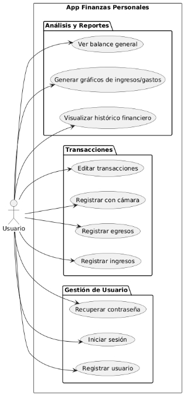
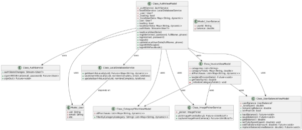
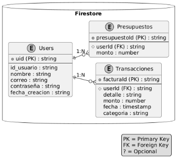

**Van  guard Money** 
## App para finanzas personales ![ref1]📌 **Planteamiento del Problema** 
En la actualidad, muchas personas tienen dificultades para llevar un control adecuado de sus gastos personales, lo que les impide optimizar sus recursos financieros. A pesar de la disponibilidad de herramientas en línea, muchas de estas no se adaptan a las necesidades específicas de cada usuario, presentando interfaces complejas o limitadas en funcionalidades. 

📌 Consecuencias: 

- Pérdida de control sobre las finanzas personales. 
- Falta de motivación para seguir un presupuesto debido a la falta de visibilidad 

  o personalización en las aplicaciones existentes. ![ref1]
### 🎯 **Alcance y Justificación** 
Alcance: El sistema tiene como objetivo automatizar el registro de ingresos y egresos, permitiendo a los usuarios gestionar sus finanzas personales de manera eficiente. La solución abarcará la creación de un interfaz accesible y fácil de usar para registrar y categorizar transacciones de manera rápida, así como generar reportes automáticos de los hábitos de consumo. Además, incluirá la integración de funciones para establecer presupuestos, alertas de gastos y recomendaciones de ahorro. La implementación también incluirá medidas de seguridad para garantizar la privacidad de los datos financieros. 

Justificación: El desarrollo de esta solución es esencial debido a la creciente necesidad de herramientas automatizadas para el manejo eficiente de las finanzas personales. Actualmente, muchas personas enfrentan dificultades para llevar un control adecuado de sus gastos, lo que afecta negativamente su capacidad de planificación financiera y toma de decisiones económicas. Una herramienta como esta no solo mejorará la gestión financiera, sino que también promoverá hábitos de consumo más responsables y permitirá a los usuarios identificar oportunidades de ahorro. La automatización del registro de gastos reducirá el tiempo invertido en tareas manuales, haciendo que la adopción de hábitos financieros saludables sea más accesible y atractiva para los usuarios. 
## 🎯 **Objetivo Principal ![ref1]**
Desarrollar una aplicación intuitiva para gestionar los gastos personales, permitiendo a los usuarios registrar, analizar y visualizar sus finanzas de manera clara y eficiente, con el objetivo de fomentar hábitos de ahorro y planificación financiera. ![ref1]
## ✅ **Objetivos Secundarios** 
- Registrar los gastos diarios, organizados por categorías (comida, transporte, entretenimiento, etc.). 
- Analizar los gastos mediante gráficos y estadísticas para identificar patrones de consumo y posibles áreas de ahorro. 
- Establecer presupuestos mensuales para cada categoría de gasto, con alertas si se superan los límites establecidos. 
- Desarrollar una interfaz amigable y accesible, con visualizaciones claras y fáciles de entender. 
## **DIAGRAMAS** 
## Diagrama de Casos 

### Diagrama de Clases 

### Diagrama de Base de datos 

[ref1]: media/Aspose.Words.5c575b22-2670-40ec-96a3-f831544e8eb6.001.png
